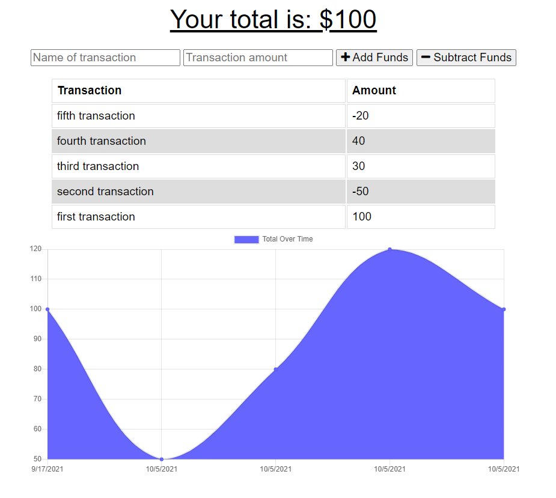

# Budget Tracker
  ## Table of Contents:
  * [Description](#description)
  * [Technologies](#technologies)
  * [Screenshots](#screenshots)
  * [Credits](#credits)
  * [License](#license)
  * [Email](#email)
  * [GitHub](#github)

## Description 

As an avid traveler, I wanted to be able to track my withdrawals and deposits with or without a data/internet connection so that my account balance is accurate when I am traveling 

## Technologies

  Javascript
  NoSQl
  Mongoose
  Express.js
  GraphQL

## Screenshots

## Credits

Created By: Brent Albers

## License

This project is copyrighted under the 

[BSD license](https://opensource.org/licenses/BSD-3-Clause)

## Email

Have any questions? feel free to email me at brent.albers@yahoo.com. 

## GitHub

Follow me on github where you can also ask me questions here at https://github.com/BA1bers.
